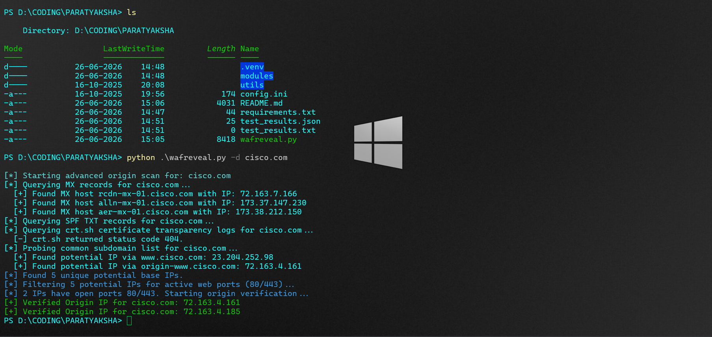
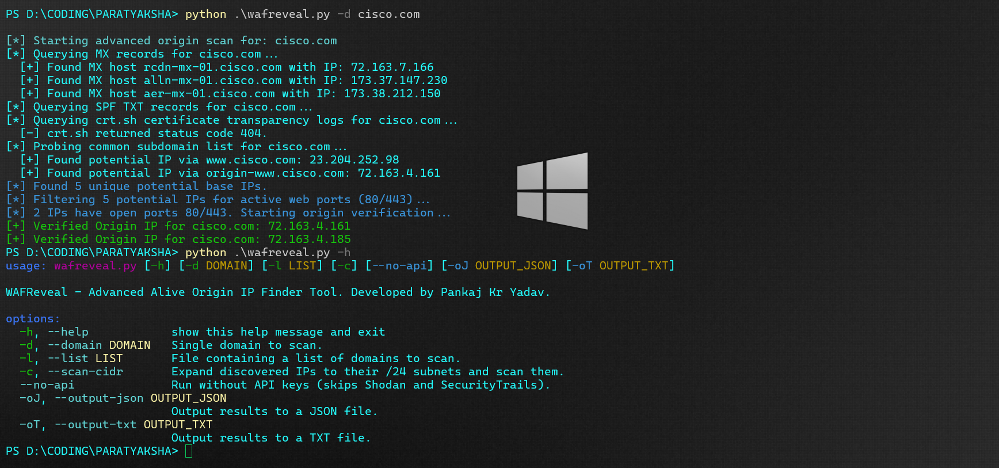

# WAFReveal (Advanced Origin IP Finder)
*Developed by Pankaj Kr Yadav*

WAFReveal is a high-performance, multi-threaded command-line security tool designed to find the true origin IP address of a target domain behind proxy networks, reverse proxies, and Web Application Firewalls (WAFs) like Cloudflare, Akamai, or AWS CloudFront.

By combining passive records harvesting, active SSL/TLS handshake inspection, and heuristic verification, WAFReveal provides high-confidence results even without expensive API keys.


---

## Features

### 🔍 Multi-Layered IP Discovery
1. **Passive DNS Records Mining (No API)**:
   - **MX Records**: Resolves configured mail servers to identify origin subnets.
   - **SPF TXT Records**: Recursively extracts IPv4/IPv6 addresses and CIDR notations defined in SPF configuration (up to 3 levels deep).
2. **Passive Subdomain Harvesting (No API)**:
   - **crt.sh Scraper**: Queries Certificate Transparency logs to find all subdomains historically issued certificates, then resolves them to IPs.
3. **Subdomain Brute-Forcing (No API)**:
   - Probes a list of common subdomains (e.g., `origin`, `direct`, `dev`, `staging`) to detect unproxied DNS leaks.
4. **Third-Party API Integrations (Optional)**:
   - **SecurityTrails API**: Harvests historical DNS A records.
   - **Shodan API**: Fetches favicon files and searches Shodan for hosts serving the exact same favicon hash.

### 🛡️ Smart Filter & Validation Engine
- **SSL/TLS Cert Handshake Verification**: Connects to port 443 of the target IP and inspects the Subject Alternative Names (SAN) and Common Name (CN) of the certificate. If it matches the target domain (even if self-signed or expired), it's verified as a true origin IP.
- **CDN and WAF Filtering**: Performs reverse DNS PTR lookups to identify and discard CDN proxies (e.g., Cloudflare, CloudFront, Fastly) early in the pipeline.
- **HTTP Redirect & Host Headers**: Customizes request host headers on direct IP connections to check for redirection towards the target domain.
- **Title Match Validation**: Validates the HTML title tag of the direct IP response against the base domain title.
- **Pre-Filtering TCP Probes**: Probes ports 80/443 in parallel before performing full HTTP scans, significantly increasing performance.

---

## Installation

1. **Clone or navigate to the repository**:
   ```bash
   cd PARATYAKSHA
   ```

2. **Create a virtual environment and install dependencies**:
   ```bash
   python -m venv .venv
   .venv\Scripts\activate      # On Windows
   source .venv/bin/activate    # On Linux/macOS
   
   pip install -r requirements.txt
   ```

3. **Configure API Keys (Optional)**:
   Rename `config.ini` or edit it to add your API keys:
   ```ini
   [api_keys]
   shodan = YOUR_SHODAN_API_KEY
   securitytrails = YOUR_SECURITYTRAILS_API_KEY

   [settings]
   proxy = 
   ```
   *If you do not have API keys, simply run the tool with the `--no-api` flag.*

---

## Usage

```bash
python wafreveal.py -d <domain> [options]
```

### Options
* `-d`, `--domain`: Scan a single domain (e.g., `example.com`).
* `-l`, `--list`: Scan a list of domains from a file (one domain per line).
* `-c`, `--scan-cidr`: Expand discovered IPs to their `/24` subnets (neighboring 254 IPs) and probe them in parallel for open ports and matching SSL certificates.
* `--no-api`: Run without any third-party APIs (Shodan and SecurityTrails). Uses only SPF, MX, crt.sh, and subdomain dictionary resolution.
* `-oJ`, `--output-json`: Export results to a JSON file.
* `-oT`, `--output-txt`: Export results to a plain-text file.



### Examples

**Standard API-less Scan (Fast, Free, No Keys Required)**:
```bash
python wafreveal.py -d example.com --no-api
```

**Full Active Subnet Scan (Aggressive /24 Network Sweep)**:
```bash
python wafreveal.py -d example.com --no-api --scan-cidr
```

**Saving Results to JSON and TXT**:
```bash
python wafreveal.py -d example.com --no-api -oJ results.json -oT results.txt
```

---

## Developer

Developed and maintained by **PankajKrYadav**.
